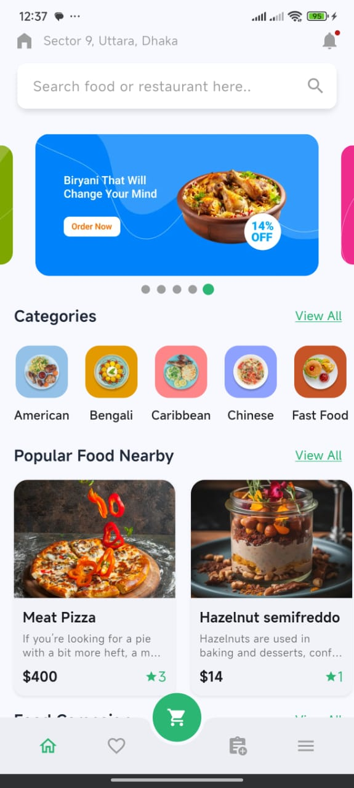
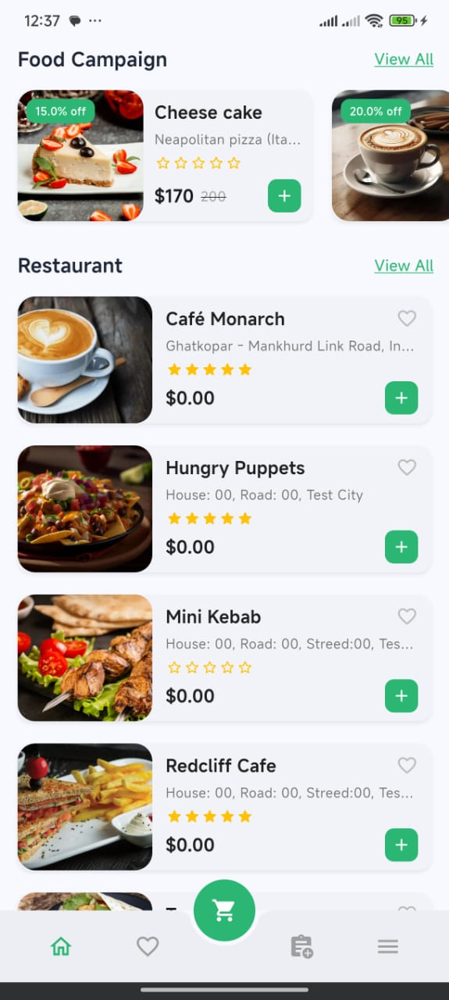
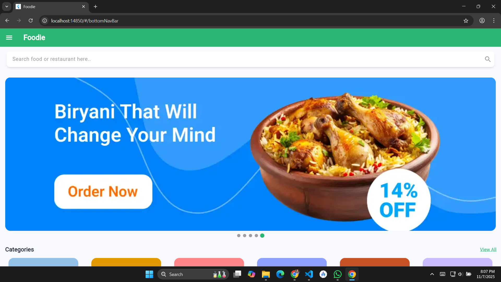
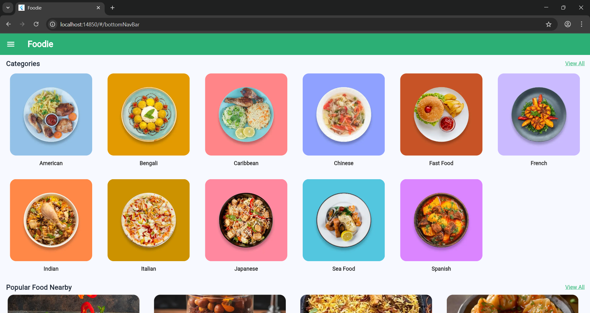
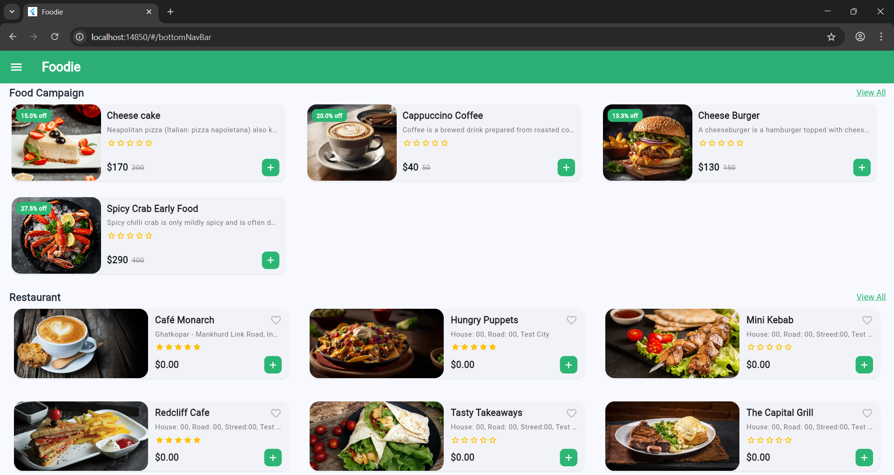

# Foodie App

A modern, responsive food delivery application built with Flutter, GetX for state management, and Dio for API communication. This project aims to provide a seamless user experience across mobile and web platforms, featuring dynamic content loading, responsive UI layouts, and a clean architecture.

## Features

- **Responsive UI**: Adapts gracefully to different screen sizes (mobile, tablet, web) with dedicated layouts for navigation, sliders, and content lists.
- **Dynamic Home Screen**: Displays various sections including:
  - Locations.
  - Auto-playing promotional banners.
  - Food categories.
  - Popular food items.
  - Food campaigns.
  - Restaurant listings with infinite scrolling.
- **State Management**: Utilizes GetX for efficient and reactive state management.
- **API Integration**: Handles network requests using Dio, with custom interceptors for error handling and logging.
- **Shimmer Loading**: Provides a smooth user experience during data fetching with shimmer loading effects.
- **Navigation**:
  - **Mobile**: Intuitive bottom navigation bar.
  - **Web/Tablet**: A clean app bar with a drawer (sidebar) for navigation.
- **Clean Architecture**: Organized codebase with clear separation of concerns (backend, core, data, presentation).

## Tech Stack

- **Framework**: Flutter
- **Language**: Dart
- **State Management**: GetX
- **HTTP Client**: Dio
- **UI/UX**: Material Design principles

## Project Structure

The project follows a modular structure to ensure maintainability and scalability:

```
lib/
├── backend/              # API client, interceptors, error handling, links
├── core/                 # Core utilities, app colors, responsive helpers
├── data/                 # Data models for API responses
│   └── models/
├── presentation/         # UI layer, features, common widgets, routing
│   ├── common/           # Reusable UI components (e.g., bottom nav bar, section heading)
│   ├── features/         # Feature-specific modules (e.g., home screen, controller, widgets)
│   │   └── home/
│   │       ├── bindings/
│   │       ├── controller/
│   │       ├── view/
│   │       └── widgets/
│   └── routes/           # Application routing definitions
└── main.dart             # Application entry point
```

## Getting Started

Follow these instructions to get a copy of the project up and running on your local machine for development and testing purposes.

### Prerequisites

- [Flutter SDK](https://flutter.dev/docs/get-started/install) installed and configured.

### Installation

1.  **Clone the repository:**
    ```bash
    git clone https://github.com/masud51435/Foodie.git
    cd foodie
    ```
2.  **Get dependencies:**
    ```bash
    flutter pub get
    ```
3.  **Run the application:**

    - **For Mobile (Android/iOS simulator or device):**
      ```bash
      flutter run
      ```
    - **For Web (Chrome browser):**
      ```bash
      flutter run -d chrome
      ```

## API Endpoints

The application interacts with the following base URL and endpoints:

- **Base URL**: `https://stackfood-admin.6amtech.com/api`
- **Endpoints**:
  - `/v1/config`
  - `/v1/banners`
  - `/v1/categories`
  - `//v1/products/popular`
  - `/v1/campaigns/item`
  - `/v1/restaurants/get-restaurants/all`

## Screenshots

|                   Mobile View                   |                   Mobile View                   |               Web View                |               Web View                |               Web View                |               Web View                |
| :---------------------------------------------: | :---------------------------------------------: | :-----------------------------------: | :-----------------------------------: | :-----------------------------------: | :-----------------------------------: |
|  |  |  |  |  |  |

## Demo Video

*  [Mobile View Video](./assets/images/foodie_video.mp4)
_Click here to watch the mobile view video._

*  [Web View Video](./assets/images/web_video.webm)
_Click here to watch the web view video._

## Contributing

Contributions are welcome! Please feel free to submit a pull request or open an issue.

## License

This project is licensed under the MIT License - see the [LICENSE](LICENSE) file for details.

## Contact

- **Name:** Md Masud Rana
- **Email:** masudrana82955@gmail.com
- **Phone:** 01829346266
